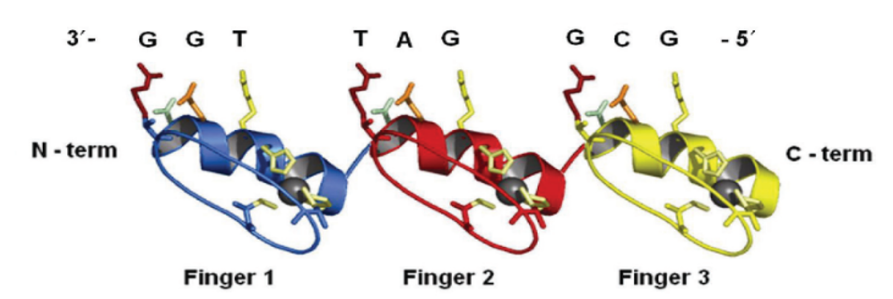
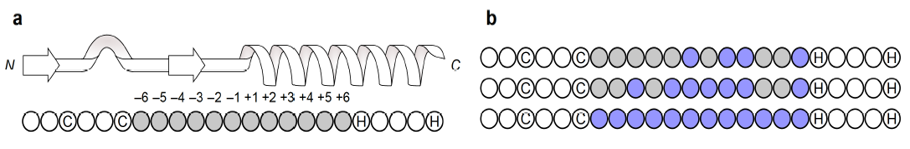

# PWMpredictor
Zinc finger (ZF) proteins are the largest class of human transcription factors with integral roles in genome regulation and function. Often using a subset of their ZFs domains, these proteins bind to diverse DNA triplets that make up the majority of the human regulatory code. 

# Example of binding DNA ZFs

One can identify a ZF  in a protein by the regular expression: CX[2,4]CX[12]HX[3,4,5]H, where C is the amino acid Cysteine, H is the amino acid Histidine and X represents any amino acid. The total length of a ZF is 12 and its positions are numbered as follows: [-6,-5,-4,-3,-2,-1,+1,+2,+3,+4,+5,+6] 

# ZF identification and a highlight of the possible influence positions

